ACS2/6
================
Devon Birdseye
10/3/2019

# Analysis of ACS2/6 mutant proteomics & comparison to BxM hybrid and inbreds

## libraries

# Re-start here after cleared environment

## Data import and editing

### Read DF RDS

``` r
df_NoDecoys_Biomart_epost <- readRDS("df_NoDecoys_Biomart_epost")
PrevSL_trim_epost2 <- readRDS("PrevSL_trim_epost")
```

### Re-order columns

``` r
DF <- df_NoDecoys_Biomart_epost
DF<- DF[,c(1,2,42,44,18,3:12)]
colnames(DF)<- c("GI", "RefSeqPep", "UID", "V4", "Protein", "b731", "b732", "b733", "mo171", "mo172", "bm1", "bm2", "acs1", "acs2", "acs3")
```

### geomean functions

``` r
BMgeomean <- function(df){
  x <- NULL
  for(i in 1:nrow(df)){
    v <- as.numeric(df[i, 17:18])
    gm <- geoMean(v, na.rm = T)
    x[i]<-gm
  }
  x
}

PrevSL_BMgeomean <- function(df){
  x <- NULL
  for(i in 1:nrow(df)){
    v <- as.numeric(df[i, 18:20])
    gm <- geoMean(v, na.rm = T)
    x[i]<-gm
  }
  x
}

ACSgeomean <- function(df){
  x <- NULL
  for(i in 1:nrow(df)){
    v <- as.numeric(df[i, 19:21])
    gm <- geoMean(v, na.rm = T)
    x[i]<-gm
  }
  x
}
```

### Set mp, bm/mp, Avgs, and SDS

``` r
DF$mp1 <- rowMeans(DF[,c(6,9)])

DF$bm1.mp1 <- DF$bm1/DF$mp1
DF$bm2.mp1 <- DF$bm2/DF$mp1

DF$acs1.b731 <- DF$acs1/DF$b731
DF$acs2.b732 <- DF$acs2/DF$b732
DF$acs3.b733 <- DF$acs3/DF$b733

DF$avg.bm.mp <- BMgeomean(DF)
DF$avg.acs.b73 <- ACSgeomean(DF)

DF$sds.bm.mp <- rowSds(as.matrix(DF[,17:18]), na.rm = T)
DF$sds.acs.b73 <- rowSds(as.matrix(DF[,19:21]), na.rm = T)
```

### Analyze PrevSL data

``` r
#Set NAs to 0
PrevSL_trim_epost2$b731[PrevSL_trim_epost2$b731==0]<-NA
PrevSL_trim_epost2$b732[PrevSL_trim_epost2$b732==0]<-NA
PrevSL_trim_epost2$b733[PrevSL_trim_epost2$b733==0]<-NA
PrevSL_trim_epost2$mo171[PrevSL_trim_epost2$mo171==0]<-NA
PrevSL_trim_epost2$mo172[PrevSL_trim_epost2$mo172==0]<-NA
PrevSL_trim_epost2$mo173[PrevSL_trim_epost2$mo173==0]<-NA
PrevSL_trim_epost2$bm1[PrevSL_trim_epost2$bm1==0]<-NA
PrevSL_trim_epost2$bm2[PrevSL_trim_epost2$bm2==0]<-NA
PrevSL_trim_epost2$bm3[PrevSL_trim_epost2$bm3==0]<-NA
# calc. mp values
PrevSL_trim_epost2$mp1 <- rowMeans(PrevSL_trim_epost2[,c(3,6)], na.rm = T)
PrevSL_trim_epost2$mp2 <- rowMeans(PrevSL_trim_epost2[,c(4,7)], na.rm = T)
PrevSL_trim_epost2$mp3 <- rowMeans(PrevSL_trim_epost2[,c(5,8)], na.rm = T)
#calc. ratios
PrevSL_trim_epost2$bm1.mp1 <- PrevSL_trim_epost2$bm1/PrevSL_trim_epost2$mp1
PrevSL_trim_epost2$bm2.mp2 <- PrevSL_trim_epost2$bm2/PrevSL_trim_epost2$mp2
PrevSL_trim_epost2$bm3.mp3 <- PrevSL_trim_epost2$bm3/PrevSL_trim_epost2$mp3
#calc average and standard dev
PrevSL_trim_epost2$avg.bm.mp <- PrevSL_BMgeomean(PrevSL_trim_epost2)
PrevSL_trim_epost2$sds.bm.mp <- rowSds(as.matrix(PrevSL_trim_epost2[,18:20]), na.rm = T)
```

### Subset to sig, above, and below

``` r
DF.acs.sig <- DF[(DF$sds.acs.b73<0.1),]
DF.bm.sig <- DF[(DF$sds.bm.mp<0.1),]

DF.acs.sig.10above <- DF.acs.sig[(DF.acs.sig$avg.acs.b73>1.1),]
DF.bm.sig.10above <- DF.bm.sig[(DF.bm.sig$avg.bm.mp>1.1),]

DF.acs.sig.10below <- DF.acs.sig[(DF.acs.sig$avg.acs.b73<0.9),]
DF.bm.sig.10below <- DF.bm.sig[(DF.bm.sig$avg.bm.mp<0.9),]

PrevSL_trim_epost2.bm.sig <- PrevSL_trim_epost2[(PrevSL_trim_epost2$sds.bm.mp<0.1),]
PrevSL_trim_epost2.bm.sig.10above <- PrevSL_trim_epost2.bm.sig[(PrevSL_trim_epost2.bm.sig$avg.bm.mp>1.1),]
PrevSL_trim_epost2.bm.sig.10below <- PrevSL_trim_epost2.bm.sig[(PrevSL_trim_epost2.bm.sig$avg.bm.mp<0.9),]
```

### calculate Log2(fold change)

``` r
DF$avg.bm.mp.l2fc <- log2(DF$avg.bm.mp)
DF$avg.acs.b73.l2fc <- log2(DF$avg.acs.b73)

DF$bm1.mp1.l2fc <- log2(DF$bm1.mp1)
DF$bm2.mp1.l2fc <- log2(DF$bm2.mp1)

DF$acs1.b731.l2fc <- log2(DF$acs1.b731)
DF$acs2.b732.l2fc <- log2(DF$acs2.b732)
DF$acs3.b733.l2fc <- log2(DF$acs3.b733)

PrevSL_trim_epost2$avg.bm.mp.l2fc <- log2(PrevSL_trim_epost2$avg.bm.mp)
PrevSL_trim_epost2$bm1.mp1.l2fc <- log2(PrevSL_trim_epost2$bm1.mp1)
PrevSL_trim_epost2$bm2.mp2.l2fc <- log2(PrevSL_trim_epost2$bm2.mp2)
PrevSL_trim_epost2$bm3.mp3.l2fc <- log2(PrevSL_trim_epost2$bm3.mp3)
```

### Subset without duplicate UIDs for KEGG

``` r
DF_NoDupUID <- DF[!(duplicated(DF$UID) | is.na(DF$UID)),]

nrow(DF)
```

    ## [1] 7664

``` r
nrow(DF_NoDupUID)
```

    ## [1] 7041

### Subset PrevSL without duplicate UIDs for KEGG

``` r
PrevSL_trim_epost2_NoDupUID <- PrevSL_trim_epost2[!(duplicated(PrevSL_trim_epost2$UID) | is.na(PrevSL_trim_epost2$UID)),]

nrow(PrevSL_trim_epost2)
```

    ## [1] 9288

``` r
nrow(PrevSL_trim_epost2_NoDupUID)
```

    ## [1] 8392

### subset to hyb and acs l2fc DFs for KEGG

``` r
DF.bm.l2fc <- DF_NoDupUID[,28:29]
DF.acs.l2fc <- DF_NoDupUID[,30:32]

rownames(DF.bm.l2fc) <- DF_NoDupUID$UID
rownames(DF.acs.l2fc) <- DF_NoDupUID$UID

#Remove the one row of NA - dont know where this came from (?)
DF.acs.sig.10below <- DF.acs.sig.10below[!(is.na(DF.acs.sig.10below$GI)),]
DF.acs.sig.10above <- DF.acs.sig.10above[!(is.na(DF.acs.sig.10above$GI)),]
```

### subset PrevSL to hyb and acs l2fc DFs for KEGG

``` r
PrevSL_trim_epost2.bm.l2fc <- PrevSL_trim_epost2_NoDupUID[,24:26]
rownames(PrevSL_trim_epost2.bm.l2fc) <- PrevSL_trim_epost2_NoDupUID$UID

PrevSL_trim_epost2.bm.l2fc<- (na.omit(PrevSL_trim_epost2.bm.l2fc))
```

### Subset DFs to discrete sections of Venn Diagrams

``` r
DF.bm.AND.acs.sig.10above <- DF.bm.sig.10above[(DF.bm.sig.10above$GI%in%DF.acs.sig.10above$GI),]
DF.bm.NOT.acs.sig.10above <- DF.bm.sig.10above[!(DF.bm.sig.10above$GI%in%DF.acs.sig.10above$GI),]
DF.acs.NOT.bm.sig.10above <- DF.acs.sig.10above[!(DF.acs.sig.10above$GI%in%DF.bm.sig.10above$GI),]

DF.bm.AND.acs.sig.10below <- DF.bm.sig.10below[(DF.bm.sig.10below$GI%in%DF.acs.sig.10below$GI),]
DF.bm.NOT.acs.sig.10below <- DF.bm.sig.10below[!(DF.bm.sig.10below$GI%in%DF.acs.sig.10below$GI),]
DF.acs.NOT.bm.sig.10below <- DF.acs.sig.10below[!(DF.acs.sig.10below$GI%in%DF.bm.sig.10below$GI),]

#check that we got everything
(nrow(DF.bm.AND.acs.sig.10above)+nrow(DF.bm.NOT.acs.sig.10above)+nrow(DF.acs.NOT.bm.sig.10above))==(length(unique(c(DF.bm.sig.10above$GI,DF.acs.sig.10above$GI))))
```

    ## [1] TRUE

``` r
(nrow(DF.bm.AND.acs.sig.10below)+nrow(DF.bm.NOT.acs.sig.10below)+nrow(DF.acs.NOT.bm.sig.10below))==(length(unique(c(DF.bm.sig.10below$GI,DF.acs.sig.10below$GI))))
```

    ## [1] TRUE

# KEGG

## Pathview and GAGE to create KEGG maps

### Define gsets and run gage on acs and hyb

``` r
zma <- kegg.gsets(species = "zma", id.type = "entrez")

keggres_HYB_DF <- gage(DF.bm.l2fc, gsets = zma$kg.sets, samp = c(1:2), same.dir = T)
keggres_ACS_DF <- gage(DF.acs.l2fc, gsets = zma$kg.sets, samp = c(1:3), same.dir = T)
keggres_PrevSL_DF <- gage(PrevSL_trim_epost2.bm.l2fc, gsets = zma$kg.sets, samp = c(1:3), same.dir = T)
```

### PVfun

``` r
PVfun <- function(keggres, foldchangev){
  dir.create(paste0((deparse(substitute(keggres))), "_",(deparse(substitute(foldchangev))),"/"))
setwd(paste0((deparse(substitute(keggres))), "_",(deparse(substitute(foldchangev))),"/"))
keggres_df = as.data.frame(keggres)
keggres_df_sig = na.omit(keggres_df[(keggres_df$p.val<0.05),])

V = rownames(keggres_df_sig)
Va = substr(V, start = 1, stop = 8)
Vb = substr(V, start = 10, stop = 100)
Vm =cbind(Va, Vb)

for(i in 1:nrow(Vm)){
  pathview(gene.data=foldchangev, pathway.id=Vm[i,1], species = "zma", out.suffix = (paste0(Vm[i,2], (deparse(substitute(keggres))))))
  }
}
```

# GO analysis

## TopGO and Gamer

### gamer cut

``` r
GAMER <- readRDS("GAMER")
gamer <- GAMER[-(1:2),]
gamer$Term <- Term(as.character(gamer$term_accession))

#Make gamer dataframe trimmed to only proteins detected in this run to use as background control set for enrichment analyses (input for "GamerCut" in GOanalysisGodata function)
GamerCut <- gamer[(gamer$db_object_id %in% DF$V4),]
GamerCut_PrevSL <- gamer[(gamer$db_object_id %in% PrevSL_trim_epost2$V4),]
```

### define <GO:photosynthesis> genes and <GO:ribosome> genes

``` r
go.photosynthesis <- na.omit(gamer[(gamer$Term=="photosynthesis"),])
accessions.go.photosynthesis <- go.photosynthesis$db_object_id

go.ribosome <- na.omit(gamer[(gamer$Term=="ribosome"),])
accessions.go.ribosome <- go.ribosome$db_object_id
```

### GOanalysis functions

``` r
## Build GOdata object
# EnrichedDF = DF with V4 accessions for GOIs in column named "V4"
# GamerCut = GAMER dataframe trimmed to control set
# ont = "BP", "MF", or "CC"
GOanalysisGodata <- function(EnrichedDF, GamerCut, ont, nodesize = 1){
  gene2GO_TissueCut <- split((as.character(GamerCut$term_accession)),GamerCut$db_object_id)
  gene2GOb_TissueCut <- gene2GO_TissueCut[-2]
  str(head(gene2GOb_TissueCut))
  geneNames_tissuecut <- names(gene2GOb_TissueCut)
  myInterestingGenes <- EnrichedDF$V4
  myInterestingGenes <- na.omit(myInterestingGenes)
  geneList <- factor(as.integer(geneNames_tissuecut %in% myInterestingGenes))
  names(geneList) <- geneNames_tissuecut
  GOdata <- new("topGOdata", ontology = ont, allGenes = geneList, annot = annFUN.gene2GO, nodeSize=nodesize, gene2GO = gene2GOb_TissueCut)
  GOdata
}

## GO analysis function to generate dataframe summary of top 20 of GO terms
# GOdata = Godata object (output of GoanalysisGodata function)

GOanalysisDF <- function(GOdata){
resultFis <- runTest(GOdata, algorithm = "classic", statistic = "fisher")
test.statF <- new("classicCount", testStatistic = GOFisherTest, name = "Fisher test")
resultFisher <- getSigGroups(GOdata, test.statF)
test.statKS <- new("classicScore", testStatistic = GOKSTest, name = "KS tests")
resultKS <- getSigGroups(GOdata, test.statKS)
test.statRW <- new("weightCount", testStatistic = GOFisherTest, name = "Fisher test", sigRatio = "ratio")
resultWeight <- getSigGroups(GOdata, test.statRW)
DF <- GenTable(GOdata, classic = resultFis, KS = resultKS, weight = resultWeight, orderBy = "classic", ranksOf = "classic", topNodes = 100)
DF
}

GOanalysisDF.list <- function(l){
  dir.create("GOdata.DFs/")
  setwd("GOdata.DFs/")
  l2 <- list(NULL)
  for(i in 1:length(l)){
   DF <- GOanalysisDF(l[[i]])
  png((paste0((names(l[i])), ".png")), height = 300, width=900)
  p<-tableGrob(DF[1:10,], rows = c())
  grid.arrange(p)
  dev.off()
  l2[[i]]<-DF
  }
  names(l2)<- names(l)
  l2
}

## GO analysis function to build map of top GO terms, output to pdf
# GOdata = Godata object (output of GoanalysisGodata function)
GOanalysisMap <- function(GOdata, nodes=10){
  resultFis <- runTest(GOdata, algorithm = "classic", statistic = "fisher")
  printGraph(GOdata, resultFis, firstSigNodes = nodes, fn.prefix = (paste0(c(deparse(substitute(GOdata))),".png")), useInfo = "all", pdfSW = TRUE)
}
```

### Read back in analyzed data

``` r
#Load back in GOdata list and GO term enrichment table list
GOdata.list <- readRDS("GOdata.list")
GO.DF.l <- readRDS("GO.DF.l")
```

### printDFs function

``` r
printDFs <- function(l){
for(i in 1:length(l)){
  print(names(l[i]))
  print((l[[i]][1:10,1:6]))}
}
```

### GO-term enrichment tables

``` r
printDFs(GO.DF.l)
```

    ## [1] "DF.acs.sig.10above.godataBP"
    ##         GO.ID                                        Term Annotated
    ## 1  GO:1901566 organonitrogen compound biosynthetic pro...      1902
    ## 2  GO:0044249               cellular biosynthetic process      3919
    ## 3  GO:0043604                  amide biosynthetic process       783
    ## 4  GO:0006412                                 translation       706
    ## 5  GO:0006518                   peptide metabolic process       786
    ## 6  GO:0043043                peptide biosynthetic process       713
    ## 7  GO:1901576      organic substance biosynthetic process      3860
    ## 8  GO:0009058                        biosynthetic process      4204
    ## 9  GO:0043603            cellular amide metabolic process       986
    ## 10 GO:0043436                   oxoacid metabolic process      1640
    ##    Significant Expected classic
    ## 1          405   247.86 < 1e-30
    ## 2          639   510.70 3.7e-20
    ## 3          190   102.04 5.3e-20
    ## 4          175    92.00 2.1e-19
    ## 5          188   102.43 4.9e-19
    ## 6          175    92.91 6.5e-19
    ## 7          622   503.01 1.9e-17
    ## 8          662   547.84 9.1e-17
    ## 9          215   128.49 9.2e-17
    ## 10         313   213.71 9.4e-16
    ## [1] "DF.bm.sig.10above.godataBP"
    ##         GO.ID                                        Term Annotated
    ## 1  GO:0015979                              photosynthesis       379
    ## 2  GO:0019684              photosynthesis, light reaction       283
    ## 3  GO:0009767     photosynthetic electron transport chain        85
    ## 4  GO:0010114                       response to red light        86
    ## 5  GO:0006091 generation of precursor metabolites and ...       677
    ## 6  GO:0010218                   response to far red light        85
    ## 7  GO:0009773 photosynthetic electron transport in pho...        58
    ## 8  GO:0010207                     photosystem II assembly       161
    ## 9  GO:0009637                      response to blue light       107
    ## 10 GO:0022900                    electron transport chain       185
    ##    Significant Expected classic
    ## 1          102    31.27 3.9e-29
    ## 2           86    23.35 1.2e-28
    ## 3           34     7.01 6.5e-16
    ## 4           34     7.10 9.9e-16
    ## 5          115    55.86 4.2e-15
    ## 6           33     7.01 5.0e-15
    ## 7           27     4.79 7.2e-15
    ## 8           46    13.28 1.6e-14
    ## 9           36     8.83 5.2e-14
    ## 10          48    15.26 2.4e-13
    ## [1] "DF.acs.sig.10above.godataCC"
    ##         GO.ID               Term Annotated Significant Expected classic
    ## 1  GO:0009507        chloroplast      2418         469   316.83 1.2e-28
    ## 2  GO:0009536            plastid      2473         473   324.03 2.4e-27
    ## 3  GO:0009532     plastid stroma       825         205   108.10 8.1e-23
    ## 4  GO:0009570 chloroplast stroma       810         202   106.13 1.1e-22
    ## 5  GO:0044391  ribosomal subunit       222          86    29.09 1.3e-22
    ## 6  GO:0022626 cytosolic ribosome       267          93    34.98 1.4e-20
    ## 7  GO:0044445     cytosolic part       322         102    42.19 4.9e-19
    ## 8  GO:0044434   chloroplast part      1313         273   172.04 2.2e-18
    ## 9  GO:0044435       plastid part      1328         275   174.01 2.9e-18
    ## 10 GO:0005840           ribosome       401         112    52.54 3.1e-16
    ## [1] "DF.bm.sig.10above.godataCC"
    ##         GO.ID                           Term Annotated Significant
    ## 1  GO:0009534          chloroplast thylakoid       471         117
    ## 2  GO:0044436                 thylakoid part       444         113
    ## 3  GO:0031976              plastid thylakoid       472         117
    ## 4  GO:0009535 chloroplast thylakoid membrane       376         102
    ## 5  GO:0009579                      thylakoid       587         132
    ## 6  GO:0055035     plastid thylakoid membrane       378         102
    ## 7  GO:0042651             thylakoid membrane       406         105
    ## 8  GO:0034357        photosynthetic membrane       415         105
    ## 9  GO:0009521                    photosystem        77          36
    ## 10 GO:0044434               chloroplast part      1313         194
    ##    Expected classic
    ## 1     38.93 5.3e-30
    ## 2     36.70 5.9e-30
    ## 3     39.01 6.6e-30
    ## 4     31.08 2.0e-29
    ## 5     48.52 2.7e-29
    ## 6     31.24 3.2e-29
    ## 7     33.56 2.1e-28
    ## 8     34.30 1.6e-27
    ## 9      6.36 1.7e-19
    ## 10   108.53 5.8e-19
    ## [1] "DF.acs.sig.10above.godataMF"
    ##         GO.ID                                     Term Annotated
    ## 1  GO:0003735       structural constituent of ribosome       276
    ## 2  GO:0005198             structural molecule activity       397
    ## 3  GO:0003743   translation initiation factor activity       109
    ## 4  GO:0003723                              RNA binding       829
    ## 5  GO:0008135 translation factor activity, RNA binding       161
    ## 6  GO:0008266                      poly(U) RNA binding        25
    ## 7  GO:0019843                             rRNA binding        52
    ## 8  GO:0043022                         ribosome binding        26
    ## 9  GO:0004826       phenylalanine-tRNA ligase activity         4
    ## 10 GO:0016851             magnesium chelatase activity         4
    ##    Significant Expected classic
    ## 1           91    36.49 4.4e-18
    ## 2           97    52.49 3.2e-10
    ## 3           38    14.41 5.4e-09
    ## 4          165   109.61 5.6e-09
    ## 5           48    21.29 1.9e-08
    ## 6           11     3.31 0.00015
    ## 7           17     6.88 0.00023
    ## 8           11     3.44 0.00024
    ## 9            4     0.53 0.00030
    ## 10           4     0.53 0.00030
    ## [1] "DF.bm.sig.10above.godataMF"
    ##         GO.ID                                        Term Annotated
    ## 1  GO:0031409                             pigment binding        20
    ## 2  GO:0016168                         chlorophyll binding        28
    ## 3  GO:0046906                        tetrapyrrole binding       182
    ## 4  GO:0015171 amino acid transmembrane transporter act...        13
    ## 5  GO:0004375 glycine dehydrogenase (decarboxylating) ...         3
    ## 6  GO:0016642 oxidoreductase activity, acting on the C...         3
    ## 7  GO:0048037                            cofactor binding       647
    ## 8  GO:0016859                cis-trans isomerase activity        54
    ## 9  GO:0019904             protein domain specific binding        64
    ## 10 GO:0051213                        dioxygenase activity        65
    ##    Significant Expected classic
    ## 1           15     1.66 5.4e-13
    ## 2           17     2.32 3.0e-12
    ## 3           34    15.11 4.8e-06
    ## 4            6     1.08 0.00033
    ## 5            3     0.25 0.00057
    ## 6            3     0.25 0.00057
    ## 7           76    53.71 0.00089
    ## 8           12     4.48 0.00128
    ## 9           13     5.31 0.00196
    ## 10          13     5.40 0.00226
    ## [1] "DF.acs.sig.10below.godataBP"
    ##         GO.ID                                        Term Annotated
    ## 1  GO:0016131           brassinosteroid metabolic process        79
    ## 2  GO:0008202                   steroid metabolic process       154
    ## 3  GO:0016128              phytosteroid metabolic process        82
    ## 4  GO:0071489 cellular response to red or far red ligh...        31
    ## 5  GO:0016132        brassinosteroid biosynthetic process        69
    ## 6  GO:0009411                              response to UV       134
    ## 7  GO:0015849                      organic acid transport       157
    ## 8  GO:0046942                   carboxylic acid transport       157
    ## 9  GO:0006865                        amino acid transport       136
    ## 10 GO:0006694                steroid biosynthetic process       126
    ##    Significant Expected classic
    ## 1           28     9.83 1.1e-07
    ## 2           43    19.17 1.5e-07
    ## 3           28    10.21 2.6e-07
    ## 4           15     3.86 1.0e-06
    ## 5           24     8.59 1.3e-06
    ## 6           37    16.68 1.5e-06
    ## 7           41    19.54 2.0e-06
    ## 8           41    19.54 2.0e-06
    ## 9           37    16.93 2.2e-06
    ## 10          35    15.68 2.4e-06
    ## [1] "DF.bm.sig.10below.godataBP"
    ##         GO.ID                                Term Annotated Significant
    ## 1  GO:0009651             response to salt stress       567          96
    ## 2  GO:0010025            wax biosynthetic process        19          10
    ## 3  GO:0010166               wax metabolic process        19          10
    ## 4  GO:0009832     plant-type cell wall biogenesis       110          28
    ## 5  GO:0006970          response to osmotic stress       606          98
    ## 6  GO:0044283 small molecule biosynthetic process      1616         217
    ## 7  GO:0042546                cell wall biogenesis       183          37
    ## 8  GO:0009225  nucleotide-sugar metabolic process        34          12
    ## 9  GO:0009058                biosynthetic process      4204         495
    ## 10 GO:0042255                   ribosome assembly       104          24
    ##    Expected classic
    ## 1     60.37 1.4e-06
    ## 2      2.02 6.7e-06
    ## 3      2.02 6.7e-06
    ## 4     11.71 7.7e-06
    ## 5     64.53 8.6e-06
    ## 6    172.07 3.4e-05
    ## 7     19.49 8.0e-05
    ## 8      3.62 0.00012
    ## 9    447.65 0.00012
    ## 10    11.07 0.00018
    ## [1] "DF.acs.sig.10below.godataCC"
    ##         GO.ID                                  Term Annotated Significant
    ## 1  GO:0009505                  plant-type cell wall       241          64
    ## 2  GO:0031224       intrinsic component of membrane      2861         426
    ## 3  GO:0016021        integral component of membrane      2839         423
    ## 4  GO:0071944                        cell periphery      2165         326
    ## 5  GO:0044425                         membrane part      3184         452
    ## 6  GO:0031225        anchored component of membrane        98          26
    ## 7  GO:0046658 anchored component of plasma membrane        87          23
    ## 8  GO:0005886                       plasma membrane      1841         269
    ## 9  GO:0008180                      COP9 signalosome        14           7
    ## 10 GO:0005783                 endoplasmic reticulum       560          94
    ##    Expected classic
    ## 1     29.97 1.1e-09
    ## 2    355.74 1.7e-07
    ## 3    353.01 1.8e-07
    ## 4    269.20 6.9e-06
    ## 5    395.90 2.8e-05
    ## 6     12.19 0.00011
    ## 7     10.82 0.00028
    ## 8    228.91 0.00066
    ## 9      1.74 0.00070
    ## 10    69.63 0.00105
    ## [1] "DF.bm.sig.10below.godataCC"
    ##         GO.ID                              Term Annotated Significant
    ## 1  GO:0005802               trans-Golgi network       117          27
    ## 2  GO:0005783             endoplasmic reticulum       560          87
    ## 3  GO:0098791              Golgi subcompartment       216          41
    ## 4  GO:0042646                  plastid nucleoid        35          12
    ## 5  GO:0042644              chloroplast nucleoid        14           7
    ## 6  GO:0022627 cytosolic small ribosomal subunit        71          18
    ## 7  GO:0044431              Golgi apparatus part       241          43
    ## 8  GO:0044445                    cytosolic part       322          53
    ## 9  GO:0000139                    Golgi membrane       129          26
    ## 10 GO:0022626                cytosolic ribosome       267          45
    ##    Expected classic
    ## 1     12.27 5.5e-05
    ## 2     58.72 7.3e-05
    ## 3     22.65 0.00010
    ## 4      3.67 0.00014
    ## 5      1.47 0.00024
    ## 6      7.44 0.00028
    ## 7     25.27 0.00030
    ## 8     33.76 0.00050
    ## 9     13.53 0.00074
    ## 10    28.00 0.00079
    ## [1] "DF.acs.sig.10below.godataMF"
    ##         GO.ID                                        Term Annotated
    ## 1  GO:0015145 monosaccharide transmembrane transporter...        20
    ## 2  GO:0051119    sugar transmembrane transporter activity        24
    ## 3  GO:0005354 galactose transmembrane transporter acti...         8
    ## 4  GO:0015146 pentose transmembrane transporter activi...         8
    ## 5  GO:0015148 D-xylose transmembrane transporter activ...         8
    ## 6  GO:0015168 glycerol transmembrane transporter activ...         8
    ## 7  GO:0015575 mannitol transmembrane transporter activ...         8
    ## 8  GO:0015576 sorbitol transmembrane transporter activ...         8
    ## 9  GO:0015591 D-ribose transmembrane transporter activ...         8
    ## 10 GO:0005355 glucose transmembrane transporter activi...        14
    ##    Significant Expected classic
    ## 1           10     2.49 4.8e-05
    ## 2           11     2.99 5.5e-05
    ## 3            6     1.00 8.2e-05
    ## 4            6     1.00 8.2e-05
    ## 5            6     1.00 8.2e-05
    ## 6            6     1.00 8.2e-05
    ## 7            6     1.00 8.2e-05
    ## 8            6     1.00 8.2e-05
    ## 9            6     1.00 8.2e-05
    ## 10           8     1.74 8.4e-05
    ## [1] "DF.bm.sig.10below.godataMF"
    ##         GO.ID                                        Term Annotated
    ## 1  GO:0004519                       endonuclease activity       137
    ## 2  GO:0016759                 cellulose synthase activity        25
    ## 3  GO:0016760 cellulose synthase (UDP-forming) activit...        25
    ## 4  GO:0019843                                rRNA binding        52
    ## 5  GO:0008168                  methyltransferase activity       163
    ## 6  GO:0004518                           nuclease activity       174
    ## 7  GO:0016741 transferase activity, transferring one-c...       173
    ## 8  GO:0016829                              lyase activity       258
    ## 9  GO:0008831 dTDP-4-dehydrorhamnose reductase activit...         4
    ## 10 GO:0009940 amino-terminal vacuolar sorting propepti...         4
    ##    Significant Expected classic
    ## 1           28    14.59 0.00048
    ## 2            9     2.66 0.00071
    ## 3            9     2.66 0.00071
    ## 4           14     5.54 0.00080
    ## 5           31    17.36 0.00089
    ## 6           32    18.54 0.00134
    ## 7           31    18.43 0.00242
    ## 8           42    27.49 0.00313
    ## 9            3     0.43 0.00443
    ## 10           3     0.43 0.00443

### Read back in analyzed data

``` r
#Load back in GOdata list and GO term enrichment table list
GOdata.venn.list <- readRDS("GOdata.venn.list")
GO.venn.DF.l <- readRDS("GO.venn.DF.l")
```

### Venn diagram discrete sections GO-term enrichments

``` r
printDFs(GO.venn.DF.l)
```

    ## [1] "DF.bm.AND.acs.sig.10above_GodataBP"
    ##         GO.ID                                        Term Annotated
    ## 1  GO:0015979                              photosynthesis       379
    ## 2  GO:0019682 glyceraldehyde-3-phosphate metabolic pro...       361
    ## 3  GO:0019684              photosynthesis, light reaction       283
    ## 4  GO:0006739                      NADP metabolic process       224
    ## 5  GO:0008299             isoprenoid biosynthetic process       363
    ## 6  GO:0008610                  lipid biosynthetic process       740
    ## 7  GO:0006081         cellular aldehyde metabolic process       447
    ## 8  GO:0009773 photosynthetic electron transport in pho...        58
    ## 9  GO:0006720                isoprenoid metabolic process       381
    ## 10 GO:0006098                     pentose-phosphate shunt       213
    ##    Significant Expected classic
    ## 1           24     5.44 4.1e-10
    ## 2           20     5.18 1.4e-07
    ## 3           17     4.06 4.5e-07
    ## 4           15     3.22 5.8e-07
    ## 5           19     5.21 7.3e-07
    ## 6           28    10.62 1.0e-06
    ## 7           21     6.42 1.0e-06
    ## 8            8     0.83 1.5e-06
    ## 9           19     5.47 1.5e-06
    ## 10          14     3.06 1.8e-06
    ## [1] "DF.bm.NOT.acs.sig.10above_GodataBP"
    ##         GO.ID                                        Term Annotated
    ## 1  GO:0019684              photosynthesis, light reaction       283
    ## 2  GO:0015979                              photosynthesis       379
    ## 3  GO:0010218                   response to far red light        85
    ## 4  GO:0010114                       response to red light        86
    ## 5  GO:0009637                      response to blue light       107
    ## 6  GO:0009765            photosynthesis, light harvesting        36
    ## 7  GO:0006091 generation of precursor metabolites and ...       677
    ## 8  GO:0009767     photosynthetic electron transport chain        85
    ## 9  GO:0009768 photosynthesis, light harvesting in phot...        20
    ## 10 GO:0018298                 protein-chromophore linkage        28
    ##    Significant Expected classic
    ## 1           69    19.33 7.4e-22
    ## 2           78    25.88 9.0e-20
    ## 3           29     5.80 8.7e-14
    ## 4           29     5.87 1.2e-13
    ## 5           31     7.31 1.8e-12
    ## 6           18     2.46 2.2e-12
    ## 7           94    46.23 4.4e-12
    ## 8           26     5.80 2.9e-11
    ## 9           13     1.37 3.0e-11
    ## 10          15     1.91 4.4e-11
    ## [1] "DF.acs.NOT.bm.sig.10above_GodataBP"
    ##         GO.ID                                        Term Annotated
    ## 1  GO:1901566 organonitrogen compound biosynthetic pro...      1902
    ## 2  GO:0043604                  amide biosynthetic process       783
    ## 3  GO:0006412                                 translation       706
    ## 4  GO:0043043                peptide biosynthetic process       713
    ## 5  GO:0006518                   peptide metabolic process       786
    ## 6  GO:0043603            cellular amide metabolic process       986
    ## 7  GO:0044249               cellular biosynthetic process      3919
    ## 8  GO:0009058                        biosynthetic process      4204
    ## 9  GO:1901576      organic substance biosynthetic process      3860
    ## 10 GO:0044271 cellular nitrogen compound biosynthetic ...      2623
    ##    Significant Expected classic
    ## 1          374   221.61 < 1e-30
    ## 2          186    91.23 2.2e-24
    ## 3          172    82.26 9.6e-24
    ## 4          172    83.08 3.2e-23
    ## 5          183    91.58 7.3e-23
    ## 6          208   114.88 1.9e-20
    ## 7          578   456.62 6.3e-20
    ## 8          600   489.83 3.3e-17
    ## 9          562   449.75 3.6e-17
    ## 10         417   305.62 3.8e-17
    ## [1] "DF.bm.AND.acs.sig.10above_GodataCC"
    ##         GO.ID                    Term Annotated Significant Expected
    ## 1  GO:0044434        chloroplast part      1313          51    19.05
    ## 2  GO:0044435            plastid part      1328          51    19.27
    ## 3  GO:0009507             chloroplast      2418          69    35.09
    ## 4  GO:0009536                 plastid      2473          69    35.89
    ## 5  GO:0009532          plastid stroma       825          35    11.97
    ## 6  GO:0009579               thylakoid       587          29     8.52
    ## 7  GO:0042651      thylakoid membrane       406          24     5.89
    ## 8  GO:0044436          thylakoid part       444          25     6.44
    ## 9  GO:0034357 photosynthetic membrane       415          24     6.02
    ## 10 GO:0009570      chloroplast stroma       810          34    11.75
    ##    classic
    ## 1  5.8e-13
    ## 2  9.2e-13
    ## 3  5.7e-12
    ## 4  1.9e-11
    ## 5  1.5e-09
    ## 6  2.0e-09
    ## 7  2.0e-09
    ## 8  2.4e-09
    ## 9  3.2e-09
    ## 10 3.7e-09
    ## [1] "DF.bm.NOT.acs.sig.10above_GodataCC"
    ##         GO.ID                           Term Annotated Significant
    ## 1  GO:0009534          chloroplast thylakoid       471          93
    ## 2  GO:0031976              plastid thylakoid       472          93
    ## 3  GO:0009535 chloroplast thylakoid membrane       376          81
    ## 4  GO:0044436                 thylakoid part       444          89
    ## 5  GO:0055035     plastid thylakoid membrane       378          81
    ## 6  GO:0009579                      thylakoid       587         104
    ## 7  GO:0042651             thylakoid membrane       406          82
    ## 8  GO:0034357        photosynthetic membrane       415          82
    ## 9  GO:0009521                    photosystem        77          30
    ## 10 GO:0009523                 photosystem II        59          26
    ##    Expected classic
    ## 1     32.16 2.7e-22
    ## 2     32.23 3.2e-22
    ## 3     25.68 6.6e-22
    ## 4     30.32 8.7e-22
    ## 5     25.81 9.5e-22
    ## 6     40.09 3.7e-21
    ## 7     27.73 2.8e-20
    ## 8     28.34 1.2e-19
    ## 9      5.26 4.7e-16
    ## 10     4.03 1.2e-15
    ## [1] "DF.acs.NOT.bm.sig.10above_GodataCC"
    ##         GO.ID                              Term Annotated Significant
    ## 1  GO:0044391                 ribosomal subunit       222          85
    ## 2  GO:0022626                cytosolic ribosome       267          93
    ## 3  GO:0044445                    cytosolic part       322         102
    ## 4  GO:0009507                       chloroplast      2418         403
    ## 5  GO:0005840                          ribosome       401         111
    ## 6  GO:0009536                           plastid      2473         407
    ## 7  GO:0022627 cytosolic small ribosomal subunit        71          38
    ## 8  GO:0015935           small ribosomal subunit        83          40
    ## 9  GO:0009570                chloroplast stroma       810         169
    ## 10 GO:0009532                    plastid stroma       825         171
    ##    Expected classic
    ## 1     25.99 2.1e-25
    ## 2     31.26 3.5e-24
    ## 3     37.70 8.2e-23
    ## 4    283.11 3.4e-20
    ## 5     46.95 1.4e-19
    ## 6    289.55 2.5e-19
    ## 7      8.31 7.6e-18
    ## 8      9.72 1.3e-16
    ## 9     94.84 9.9e-16
    ## 10    96.60 1.2e-15
    ## [1] "DF.bm.AND.acs.sig.10above_GodataMF"
    ##         GO.ID                                        Term Annotated
    ## 1  GO:0050242       pyruvate, phosphate dikinase activity         2
    ## 2  GO:0016859                cis-trans isomerase activity        54
    ## 3  GO:0016781 phosphotransferase activity, paired acce...         4
    ## 4  GO:0042132 fructose 1,6-bisphosphate 1-phosphatase ...         5
    ## 5  GO:0019904             protein domain specific binding        64
    ## 6  GO:0003755 peptidyl-prolyl cis-trans isomerase acti...        49
    ## 7  GO:0004849                     uridine kinase activity         8
    ## 8  GO:0016731 oxidoreductase activity, acting on iron-...        10
    ## 9  GO:0000287                       magnesium ion binding        88
    ## 10 GO:0004427            inorganic diphosphatase activity        11
    ##    Significant Expected classic
    ## 1            2     0.03 0.00021
    ## 2            5     0.79 0.00110
    ## 3            2     0.06 0.00125
    ## 4            2     0.07 0.00207
    ## 5            5     0.94 0.00236
    ## 6            4     0.72 0.00556
    ## 7            2     0.12 0.00562
    ## 8            2     0.15 0.00887
    ## 9            5     1.29 0.00919
    ## 10           2     0.16 0.01074
    ## [1] "DF.bm.NOT.acs.sig.10above_GodataMF"
    ##         GO.ID                                        Term Annotated
    ## 1  GO:0031409                             pigment binding        20
    ## 2  GO:0016168                         chlorophyll binding        28
    ## 3  GO:0046906                        tetrapyrrole binding       182
    ## 4  GO:0004375 glycine dehydrogenase (decarboxylating) ...         3
    ## 5  GO:0016642 oxidoreductase activity, acting on the C...         3
    ## 6  GO:0015171 amino acid transmembrane transporter act...        13
    ## 7  GO:0051213                        dioxygenase activity        65
    ## 8  GO:0005381 iron ion transmembrane transporter activ...         5
    ## 9  GO:0048037                            cofactor binding       647
    ## 10 GO:0140110            transcription regulator activity       142
    ##    Significant Expected classic
    ## 1           13     1.37 3.1e-11
    ## 2           15     1.92 4.5e-11
    ## 3           30    12.47 5.0e-06
    ## 4            3     0.21 0.00032
    ## 5            3     0.21 0.00032
    ## 6            5     0.89 0.00120
    ## 7           12     4.45 0.00133
    ## 8            3     0.34 0.00288
    ## 9           62    44.32 0.00350
    ## 10          19     9.73 0.00359
    ## [1] "DF.acs.NOT.bm.sig.10above_GodataMF"
    ##         GO.ID                                     Term Annotated
    ## 1  GO:0003735       structural constituent of ribosome       276
    ## 2  GO:0005198             structural molecule activity       397
    ## 3  GO:0003723                              RNA binding       829
    ## 4  GO:0003743   translation initiation factor activity       109
    ## 5  GO:0008135 translation factor activity, RNA binding       161
    ## 6  GO:0019843                             rRNA binding        52
    ## 7  GO:0043022                         ribosome binding        26
    ## 8  GO:0043021        ribonucleoprotein complex binding        44
    ## 9  GO:0004826       phenylalanine-tRNA ligase activity         4
    ## 10 GO:0008266                      poly(U) RNA binding        25
    ##    Significant Expected classic
    ## 1           90    32.61 6.9e-21
    ## 2           96    46.90 1.0e-12
    ## 3          160    97.94 1.6e-11
    ## 4           38    12.88 2.1e-10
    ## 5           48    19.02 4.4e-10
    ## 6           17     6.14 5.7e-05
    ## 7           11     3.07 8.4e-05
    ## 8           15     5.20 9.0e-05
    ## 9            4     0.47 0.00019
    ## 10           9     2.95 0.00151
    ## [1] "DF.bm.AND.acs.sig.10below_GodataBP"
    ##         GO.ID                                        Term Annotated
    ## 1  GO:0010025                    wax biosynthetic process        19
    ## 2  GO:0010166                       wax metabolic process        19
    ## 3  GO:1901570 fatty acid derivative biosynthetic proce...        26
    ## 4  GO:0009698           phenylpropanoid metabolic process       247
    ## 5  GO:0009699        phenylpropanoid biosynthetic process       164
    ## 6  GO:1901568     fatty acid derivative metabolic process        35
    ## 7  GO:0044550 secondary metabolite biosynthetic proces...       341
    ## 8  GO:0019748                 secondary metabolic process       588
    ## 9  GO:0009832             plant-type cell wall biogenesis       110
    ## 10 GO:0000038 very long-chain fatty acid metabolic pro...        45
    ##    Significant Expected classic
    ## 1            8     0.37 1.0e-09
    ## 2            8     0.37 1.0e-09
    ## 3            8     0.50 1.9e-08
    ## 4           20     4.79 4.6e-08
    ## 5           16     3.18 8.9e-08
    ## 6            8     0.68 2.5e-07
    ## 7           22     6.61 5.2e-07
    ## 8           30    11.39 6.0e-07
    ## 9           11     2.13 8.1e-06
    ## 10           7     0.87 2.2e-05
    ## [1] "DF.bm.NOT.acs.sig.10below_GodataBP"
    ##         GO.ID                                        Term Annotated
    ## 1  GO:0009058                        biosynthetic process      4204
    ## 2  GO:0042255                           ribosome assembly       104
    ## 3  GO:1901576      organic substance biosynthetic process      3860
    ## 4  GO:0009651                     response to salt stress       567
    ## 5  GO:0044249               cellular biosynthetic process      3919
    ## 6  GO:0006970                  response to osmotic stress       606
    ## 7  GO:0042256                    mature ribosome assembly        55
    ## 8  GO:0070925                          organelle assembly       144
    ## 9  GO:0044283         small molecule biosynthetic process      1616
    ## 10 GO:0042401 cellular biogenic amine biosynthetic pro...        52
    ##    Significant Expected classic
    ## 1          421   366.20 1.5e-06
    ## 2           24     9.06 6.8e-06
    ## 3          388   336.24 7.5e-06
    ## 4           79    49.39 1.1e-05
    ## 5          390   341.38 2.3e-05
    ## 6           81    52.79 4.0e-05
    ## 7           14     4.79 0.00019
    ## 8           26    12.54 0.00025
    ## 9          176   140.77 0.00033
    ## 10          13     4.53 0.00038
    ## [1] "DF.acs.NOT.bm.sig.10below_GodataBP"
    ##         GO.ID                                        Term Annotated
    ## 1  GO:0010017      red or far-red light signaling pathway        30
    ## 2  GO:0071489 cellular response to red or far red ligh...        31
    ## 3  GO:0010224                            response to UV-B        71
    ## 4  GO:0015849                      organic acid transport       157
    ## 5  GO:0046942                   carboxylic acid transport       157
    ## 6  GO:0016131           brassinosteroid metabolic process        79
    ## 7  GO:0008202                   steroid metabolic process       154
    ## 8  GO:0043090                           amino acid import        74
    ## 9  GO:0006865                        amino acid transport       136
    ## 10 GO:0009583                 detection of light stimulus        28
    ##    Significant Expected classic
    ## 1           13     3.16 3.8e-06
    ## 2           13     3.26 5.9e-06
    ## 3           20     7.47 2.7e-05
    ## 4           34    16.52 2.8e-05
    ## 5           34    16.52 2.8e-05
    ## 6           21     8.31 4.4e-05
    ## 7           33    16.20 4.6e-05
    ## 8           20     7.79 5.1e-05
    ## 9           30    14.31 5.8e-05
    ## 10          11     2.95 6.5e-05
    ## [1] "DF.bm.AND.acs.sig.10below_GodataCC"
    ##         GO.ID                                  Term Annotated Significant
    ## 1  GO:0016021        integral component of membrane      2839          74
    ## 2  GO:0031224       intrinsic component of membrane      2861          74
    ## 3  GO:0031225        anchored component of membrane        98           8
    ## 4  GO:0009505                  plant-type cell wall       241          13
    ## 5  GO:0005783                 endoplasmic reticulum       560          22
    ## 6  GO:0044425                         membrane part      3184          77
    ## 7  GO:0042644                  chloroplast nucleoid        14           3
    ## 8  GO:0042646                      plastid nucleoid        35           4
    ## 9  GO:0046658 anchored component of plasma membrane        87           6
    ## 10 GO:0005789        endoplasmic reticulum membrane       246          11
    ##    Expected classic
    ## 1     52.91 0.00013
    ## 2     53.32 0.00017
    ## 3      1.83 0.00045
    ## 4      4.49 0.00052
    ## 5     10.44 0.00060
    ## 6     59.34 0.00121
    ## 7      0.26 0.00198
    ## 8      0.65 0.00386
    ## 9      1.62 0.00550
    ## 10     4.58 0.00602
    ## [1] "DF.bm.NOT.acs.sig.10below_GodataCC"
    ##         GO.ID                              Term Annotated Significant
    ## 1  GO:0044445                    cytosolic part       322          53
    ## 2  GO:0022626                cytosolic ribosome       267          45
    ## 3  GO:0098791              Golgi subcompartment       216          38
    ## 4  GO:0022627 cytosolic small ribosomal subunit        71          18
    ## 5  GO:0044431              Golgi apparatus part       241          40
    ## 6  GO:0005802               trans-Golgi network       117          24
    ## 7  GO:0000139                    Golgi membrane       129          25
    ## 8  GO:0044391                 ribosomal subunit       222          36
    ## 9  GO:0005840                          ribosome       401          56
    ## 10 GO:0015935           small ribosomal subunit        83          18
    ##    Expected classic
    ## 1     27.76 2.4e-06
    ## 2     23.02 7.5e-06
    ## 3     18.62 1.4e-05
    ## 4      6.12 2.2e-05
    ## 5     20.78 3.5e-05
    ## 6     10.09 4.6e-05
    ## 7     11.12 8.6e-05
    ## 8     19.14 0.00014
    ## 9     34.57 0.00016
    ## 10     7.16 0.00019
    ## [1] "DF.acs.NOT.bm.sig.10below_GodataCC"
    ##         GO.ID                            Term Annotated Significant
    ## 1  GO:0009505            plant-type cell wall       241          51
    ## 2  GO:0071944                  cell periphery      2165         279
    ## 3  GO:0031224 intrinsic component of membrane      2861         352
    ## 4  GO:0016021  integral component of membrane      2839         349
    ## 5  GO:0000786                      nucleosome        42          12
    ## 6  GO:0044815           DNA packaging complex        42          12
    ## 7  GO:0000785                       chromatin       124          25
    ## 8  GO:0005886                 plasma membrane      1841         229
    ## 9  GO:0044425                   membrane part      3184         375
    ## 10 GO:0008180                COP9 signalosome        14           6
    ##    Expected classic
    ## 1     25.51 7.3e-07
    ## 2    229.16 2.2e-05
    ## 3    302.83 6.7e-05
    ## 4    300.50 8.1e-05
    ## 5      4.45  0.0010
    ## 6      4.45  0.0010
    ## 7     13.13  0.0011
    ## 8    194.86  0.0017
    ## 9    337.02  0.0018
    ## 10     1.48  0.0020
    ## [1] "DF.bm.AND.acs.sig.10below_GodataMF"
    ##         GO.ID                                        Term Annotated
    ## 1  GO:0005354 galactose transmembrane transporter acti...         8
    ## 2  GO:0015146 pentose transmembrane transporter activi...         8
    ## 3  GO:0015148 D-xylose transmembrane transporter activ...         8
    ## 4  GO:0015168 glycerol transmembrane transporter activ...         8
    ## 5  GO:0015575 mannitol transmembrane transporter activ...         8
    ## 6  GO:0015576 sorbitol transmembrane transporter activ...         8
    ## 7  GO:0015591 D-ribose transmembrane transporter activ...         8
    ## 8  GO:0010280            UDP-L-rhamnose synthase activity         2
    ## 9  GO:0050377        UDP-glucose 4,6-dehydratase activity         2
    ## 10 GO:0015145 monosaccharide transmembrane transporter...        20
    ##    Significant Expected classic
    ## 1            3     0.15 0.00034
    ## 2            3     0.15 0.00034
    ## 3            3     0.15 0.00034
    ## 4            3     0.15 0.00034
    ## 5            3     0.15 0.00034
    ## 6            3     0.15 0.00034
    ## 7            3     0.15 0.00034
    ## 8            2     0.04 0.00035
    ## 9            2     0.04 0.00035
    ## 10           4     0.38 0.00046
    ## [1] "DF.bm.NOT.acs.sig.10below_GodataMF"
    ##         GO.ID                                        Term Annotated
    ## 1  GO:0019843                                rRNA binding        52
    ## 2  GO:0003735          structural constituent of ribosome       276
    ## 3  GO:0004519                       endonuclease activity       137
    ## 4  GO:0008168                  methyltransferase activity       163
    ## 5  GO:0004518                           nuclease activity       174
    ## 6  GO:0009940 amino-terminal vacuolar sorting propepti...         4
    ## 7  GO:0016720 delta12-fatty acid dehydrogenase activit...         4
    ## 8  GO:0047334 diphosphate-fructose-6-phosphate 1-phosp...         4
    ## 9  GO:0003723                                 RNA binding       829
    ## 10 GO:0009975                            cyclase activity         8
    ##    Significant Expected classic
    ## 1           14     4.56 0.00010
    ## 2           41    24.20 0.00049
    ## 3           24    12.01 0.00073
    ## 4           26    14.29 0.00187
    ## 5           27    15.25 0.00233
    ## 6            3     0.35 0.00251
    ## 7            3     0.35 0.00251
    ## 8            3     0.35 0.00251
    ## 9           95    72.67 0.00278
    ## 10           4     0.70 0.00307
    ## [1] "DF.acs.NOT.bm.sig.10below_GodataMF"
    ##         GO.ID                                        Term Annotated
    ## 1  GO:0046982         protein heterodimerization activity        48
    ## 2  GO:0046983               protein dimerization activity       169
    ## 3  GO:0045735                 nutrient reservoir activity        11
    ## 4  GO:0050321                 tau-protein kinase activity        11
    ## 5  GO:0016307 phosphatidylinositol phosphate kinase ac...         5
    ## 6  GO:0020037                                heme binding       152
    ## 7  GO:0050625 2-hydroxy-1,4-benzoquinone reductase act...         3
    ## 8  GO:0003682                           chromatin binding        74
    ## 9  GO:0003677                                 DNA binding       479
    ## 10 GO:0004601                         peroxidase activity        87
    ##    Significant Expected classic
    ## 1           15     5.07 7.6e-05
    ## 2           33    17.86 0.00032
    ## 3            6     1.16 0.00039
    ## 4            6     1.16 0.00039
    ## 5            4     0.53 0.00057
    ## 6           29    16.06 0.00108
    ## 7            3     0.32 0.00118
    ## 8           17     7.82 0.00148
    ## 9           71    50.61 0.00164
    ## 10          18     9.19 0.00375

# Distance matrices to analyze bio replicates

## Build distance matrix of bio reps

``` r
#Build distance matrix of bio reps
df_NoDecoys_Biomart_epost_bioreps <- df_NoDecoys_Biomart_epost
df_NoDecoys_Biomart_epost_bioreps <- df_NoDecoys_Biomart_epost_bioreps[,c(3:12)]
colnames(df_NoDecoys_Biomart_epost_bioreps)<- c("b73.1", "b73.2", "b73.3", "mo17.1", "mo17.2", "BM.1", "BM.2", "acs.1", "acs.2", "acs.3")
df_NoDecoys_Biomart_epost_bioreps <- t(df_NoDecoys_Biomart_epost_bioreps)
dist_bioreps <- dist(df_NoDecoys_Biomart_epost_bioreps, method = "euclidean")
dist_bioreps
```

    ##              b73.1       b73.2       b73.3      mo17.1      mo17.2
    ## b73.2  11716374990                                                
    ## b73.3  13665007973  6350486541                                    
    ## mo17.1 24224046683 27863679798 32517787336                        
    ## mo17.2 14325147133 13418070791 17302867028 17134496044            
    ## BM.1   15372557917  6632997591  6139884714 30948831640 14632775615
    ## BM.2    8936851610  8424476711  7891046160 27630124825 12931183606
    ## acs.1  15807529680 25723465556 25381626653 34268217390 27896544115
    ## acs.2  29158689087 30686251698 25911905454 52147559527 38803109103
    ## acs.3  32340173244 33553936672 28832015965 55268441481 41854465813
    ##               BM.1        BM.2       acs.1       acs.2
    ## b73.2                                                 
    ## b73.3                                                 
    ## mo17.1                                                
    ## mo17.2                                                
    ## BM.1                                                  
    ## BM.2    8286616649                                    
    ## acs.1  28087573116 21383986830                        
    ## acs.2  29372634557 27184305383 24659445380            
    ## acs.3  32222343305 30369922924 27254166733  4092126997

## Plot distance matrix

``` r
#Plot distance matrix - bio reps
res.dist_bioreps <- factoextra::get_dist(df_NoDecoys_Biomart_epost_bioreps, stand = F, method = "euclidian")
factoextra::fviz_dist(res.dist_bioreps, 
   gradient = list(low = "#00AFBB", mid = "white", high = "#FC4E07"), order = T)
```

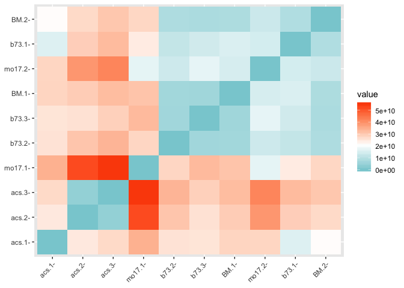<!-- -->

``` r
ggsave("bioreps_dist.png")
```

    ## Saving 7 x 5 in image

## build heirarchical clustering

``` r
#build heirarchical clustering - bio reps
hc_bioreps<- hclust(dist_bioreps, method = "ward.D2")
hcd_bioreps <- as.dendrogram(hc_bioreps)
plot(hcd_bioreps, type = "rectangle", ylab = "height")
```

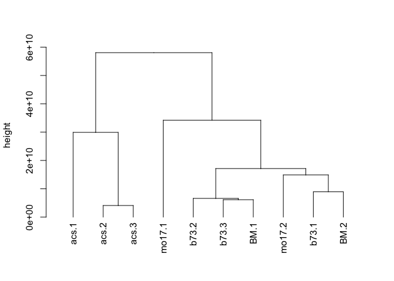<!-- -->

## Build distance matrix of bio reps - plastid-encoded

``` r
#Build distance matrix of bio reps
df_NoDecoys_Biomart_epost_bioreps_plastid <- df_NoDecoys_Biomart_epost
df_NoDecoys_Biomart_epost_bioreps_plastid <- df_NoDecoys_Biomart_epost_bioreps_plastid[grep("NP_04",df_NoDecoys_Biomart_epost_bioreps_plastid$Protein),]
df_NoDecoys_Biomart_epost_bioreps_plastid <- df_NoDecoys_Biomart_epost_bioreps_plastid[,c(3:12)]
colnames(df_NoDecoys_Biomart_epost_bioreps_plastid)<- c("b73.1", "b73.2", "b73.3", "mo17.1", "mo17.2", "BM.1", "BM.2", "acs.1", "acs.2", "acs.3")
df_NoDecoys_Biomart_epost_bioreps_plastid <- t(df_NoDecoys_Biomart_epost_bioreps_plastid)
dist_bioreps_plastid <- dist(df_NoDecoys_Biomart_epost_bioreps_plastid, method = "euclidean")
dist_bioreps_plastid
```

    ##              b73.1       b73.2       b73.3      mo17.1      mo17.2
    ## b73.2   7901419217                                                
    ## b73.3  11726993356  4557982931                                    
    ## mo17.1 14068090239 21722645755 25348980279                        
    ## mo17.2  2789597965  8040332446 11140095315 14483920917            
    ## BM.1   12082597404  4923728726  1300869368 25774985972 11448095255
    ## BM.2    7864616604  4468420566  5176467697 21002443694  6547722714
    ## acs.1   5018278189 12565245584 16611476617 10213438094  6588249643
    ## acs.2  16606426809  9330130945  5130322645 30283937982 15898372072
    ## acs.3  18035923866 10661968580  6883649618 31781271386 17372894656
    ##               BM.1        BM.2       acs.1       acs.2
    ## b73.2                                                 
    ## b73.3                                                 
    ## mo17.1                                                
    ## mo17.2                                                
    ## BM.1                                                  
    ## BM.2    5283621180                                    
    ## acs.1  16875343972 12573793984                        
    ## acs.2   4638212402  9483034125 21394634266            
    ## acs.3   6235669503 10984860705 22683525101  2366340682

## Plot distance matrix - plastid-encoded

``` r
#Plot distance matrix - bio reps
res.dist_bioreps <- factoextra::get_dist(df_NoDecoys_Biomart_epost_bioreps_plastid, stand = F, method = "euclidian")
factoextra::fviz_dist(res.dist_bioreps, 
   gradient = list(low = "#00AFBB", mid = "white", high = "#FC4E07"), order = T)
```

<!-- -->

``` r
ggsave("bioreps_plastid_dist.png")
```

    ## Saving 7 x 5 in image

## build heirarchical clustering - plastid-encoded

``` r
#build heirarchical clustering - bio reps
hc_bioreps_plastid<- hclust(dist_bioreps_plastid, method = "ward.D2")
hcd_bioreps_plastid <- as.dendrogram(hc_bioreps_plastid)
plot(hcd_bioreps_plastid, type = "rectangle", ylab = "height")
```

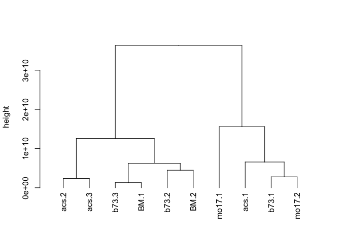<!-- -->

## Build distance matrix of bio reps - <GO:photosynthesis>

``` r
#Build distance matrix of bio reps
df_NoDecoys_Biomart_epost_bioreps_go.photo<- df_NoDecoys_Biomart_epost
df_NoDecoys_Biomart_epost_bioreps_go.photo <- df_NoDecoys_Biomart_epost_bioreps_go.photo[(df_NoDecoys_Biomart_epost_bioreps_go.photo$V4%in%accessions.go.photosynthesis),]
df_NoDecoys_Biomart_epost_bioreps_go.photo <- df_NoDecoys_Biomart_epost_bioreps_go.photo[,c(3:12)]
colnames(df_NoDecoys_Biomart_epost_bioreps_go.photo)<- c("b73.1", "b73.2", "b73.3", "mo17.1", "mo17.2", "BM.1", "BM.2", "acs.1", "acs.2", "acs.3")
df_NoDecoys_Biomart_epost_bioreps_go.photo <- t(df_NoDecoys_Biomart_epost_bioreps_go.photo)
dist_bioreps_go.photo <- dist(df_NoDecoys_Biomart_epost_bioreps_go.photo, method = "euclidean")
dist_bioreps_go.photo
```

    ##              b73.1       b73.2       b73.3      mo17.1      mo17.2
    ## b73.2   7148564571                                                
    ## b73.3   3493558918  3700941699                                    
    ## mo17.1 17015046580 10367895868 13863589490                        
    ## mo17.2 12323845400  5544638660  9076721955  4852665875            
    ## BM.1    7265219059   337691121  3841267349 10189303107  5355454741
    ## BM.2    2374230472  4819162693  1339231316 14679458663  9961190721
    ## acs.1  14189122220 21283780901 17585402174 31122397521 26490424037
    ## acs.2  20642049549 27665165245 23973814252 37622812016 32949999879
    ## acs.3  22754035548 29762989453 26074583216 39737973183 35060027619
    ##               BM.1        BM.2       acs.1       acs.2
    ## b73.2                                                 
    ## b73.3                                                 
    ## mo17.1                                                
    ## mo17.2                                                
    ## BM.1                                                  
    ## BM.2    4920302492                                    
    ## acs.1  21411196363 16553585740                        
    ## acs.2  27800816160 22998610712  6555746632            
    ## acs.3  29900723343 25108866936  8676220840  2126247483

## Plot distance matrix - <GO:photosynthesis>

``` r
#Plot distance matrix - bio reps
res.dist_bioreps <- factoextra::get_dist(df_NoDecoys_Biomart_epost_bioreps_go.photo, stand = F, method = "euclidian")
factoextra::fviz_dist(res.dist_bioreps, 
   gradient = list(low = "#00AFBB", mid = "white", high = "#FC4E07"))
```

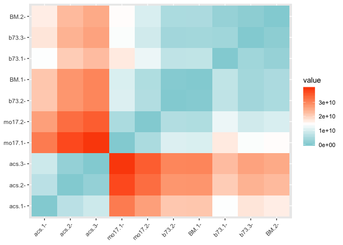<!-- -->

``` r
ggsave("bioreps_nuclear_GO_photo_dist.png")
```

    ## Saving 7 x 5 in image

## build heirarchical clustering - <GO:photosynthesis>

``` r
#build heirarchical clustering - bio reps
hc_bioreps_go.photo<- hclust(dist_bioreps_go.photo)
hcd_bioreps_go.photo <- as.dendrogram(hc_bioreps_go.photo)
plot(hcd_bioreps_go.photo, type = "rectangle", ylab = "height")
```

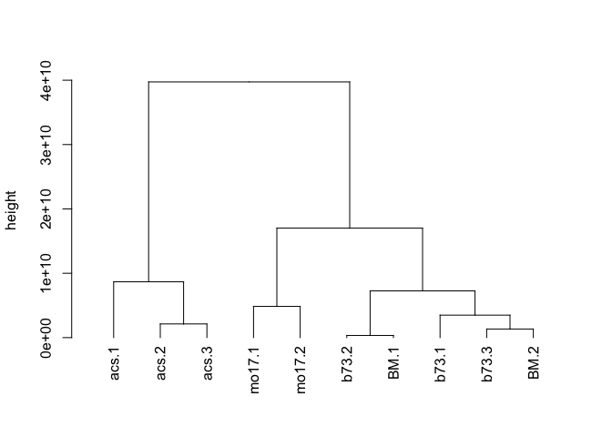<!-- -->

## Build distance matrix of bio reps - “ribosomal protein”

``` r
#Build distance matrix of bio reps
df_NoDecoys_Biomart_epost_bioreps_go.ribosome<- df_NoDecoys_Biomart_epost
df_NoDecoys_Biomart_epost_bioreps_go.ribosome <- df_NoDecoys_Biomart_epost_bioreps_go.ribosome[grep("ribosomal protein",df_NoDecoys_Biomart_epost_bioreps_go.ribosome$Protein),]
df_NoDecoys_Biomart_epost_bioreps_go.ribosome <- df_NoDecoys_Biomart_epost_bioreps_go.ribosome[,c(3:12)]
colnames(df_NoDecoys_Biomart_epost_bioreps_go.ribosome)<- c("b73.1", "b73.2", "b73.3", "mo17.1", "mo17.2", "BM.1", "BM.2", "acs.1", "acs.2", "acs.3")
df_NoDecoys_Biomart_epost_bioreps_go.ribosome <- t(df_NoDecoys_Biomart_epost_bioreps_go.ribosome)
dist_bioreps_go.ribosome <- dist(df_NoDecoys_Biomart_epost_bioreps_go.ribosome, method = "euclidean", diag=T, upper=T)
dist_bioreps_go.ribosome
```

    ##             b73.1      b73.2      b73.3     mo17.1     mo17.2       BM.1
    ## b73.1           0  810410725  806838417  520720431  391278167  435658563
    ## b73.2   810410725          0  169805443  814024576  616868328  418595932
    ## b73.3   806838417  169805443          0  754071449  565775812  402331227
    ## mo17.1  520720431  814024576  754071449          0  300037263  493886640
    ## mo17.2  391278167  616868328  565775812  300037263          0  239103733
    ## BM.1    435658563  418595932  402331227  493886640  239103733          0
    ## BM.2    318698470  698775745  645129030  305435155  138294205  311743612
    ## acs.1   465829856 1241838203 1235147062  701755442  741409071  862026079
    ## acs.2   231310847  965388993  965613253  701819690  558773624  596219101
    ## acs.3   262755429  785965274  814716380  719092464  516534409  469004342
    ##              BM.2      acs.1      acs.2      acs.3
    ## b73.1   318698470  465829856  231310847  262755429
    ## b73.2   698775745 1241838203  965388993  785965274
    ## b73.3   645129030 1235147062  965613253  814716380
    ## mo17.1  305435155  701755442  701819690  719092464
    ## mo17.2  138294205  741409071  558773624  516534409
    ## BM.1    311743612  862026079  596219101  469004342
    ## BM.2            0  650166358  478118593  478863385
    ## acs.1   650166358          0  445094484  615857063
    ## acs.2   478118593  445094484          0  243191140
    ## acs.3   478863385  615857063  243191140          0

## Plot distance matrix - “ribosomal protein”

``` r
#Plot distance matrix - bio reps
res.dist_bioreps <- factoextra::get_dist(df_NoDecoys_Biomart_epost_bioreps_go.ribosome, stand = F, method = "euclidian")
factoextra::fviz_dist(res.dist_bioreps, 
   gradient = list(low = "#00AFBB", mid = "white", high = "#FC4E07"))
```

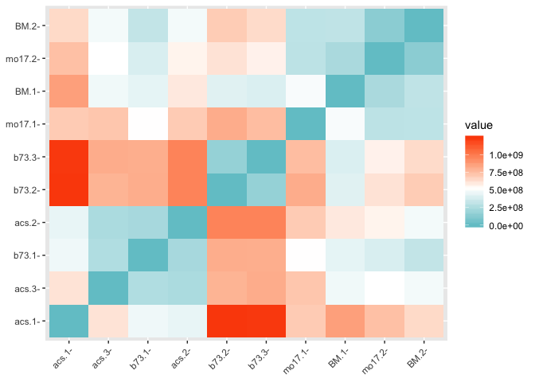<!-- -->

``` r
ggsave("bioreps_nuclear_GO_ribosome_dist.png")
```

    ## Saving 7 x 5 in image

## build heirarchical clustering - “ribosomal protein”

``` r
#build heirarchical clustering - bio reps
hc_bioreps_go.ribosome<- hclust(dist_bioreps_go.ribosome)
hcd_bioreps_go.ribosome <- as.dendrogram(hc_bioreps_go.ribosome)
plot(hcd_bioreps_go.ribosome, type = "rectangle", ylab = "height")
```

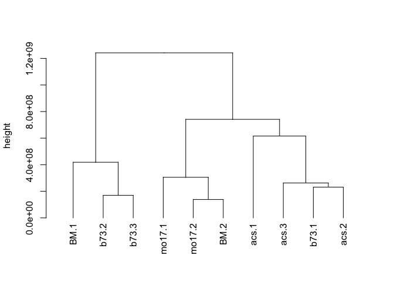<!-- -->

# heatmaps

``` r
library(RColorBrewer)
```

## build matrices

``` r
dist_bioreps_go.ribosome.m <- as.matrix(dist_bioreps_go.ribosome)
dist_bioreps_go.photo.m <- as.matrix(dist_bioreps_go.photo)
dist_bioreps_plastid.m <- as.matrix(dist_bioreps_plastid)
dist_bioreps.m <- as.matrix(dist_bioreps)
```

## heatmap:all

``` r
heatmap(dist_bioreps.m, col =colorRampPalette(brewer.pal(8, "Blues"))(25), symm = T)
```

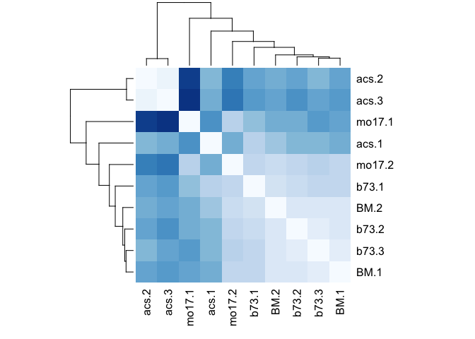<!-- --> \#\#
heatmap:plastid-encoded

``` r
heatmap(dist_bioreps_plastid.m, col =colorRampPalette(brewer.pal(8, "Blues"))(25), symm = T)
```

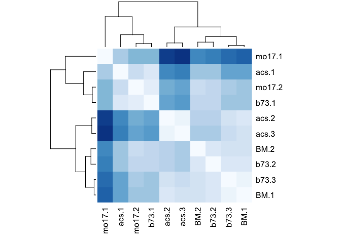<!-- --> \#\#
heatmap:<GO:photosynthesis>

``` r
heatmap(dist_bioreps_go.photo.m, col =colorRampPalette(brewer.pal(8, "Blues"))(25), symm = T)
```

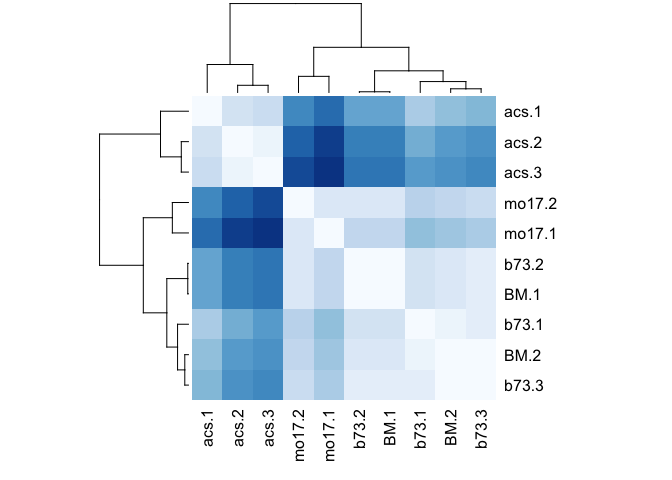<!-- --> \#\#
heatmap:ribosome

``` r
heatmap(dist_bioreps_go.ribosome.m, col =colorRampPalette(brewer.pal(8, "Blues"))(25), symm = T)
```

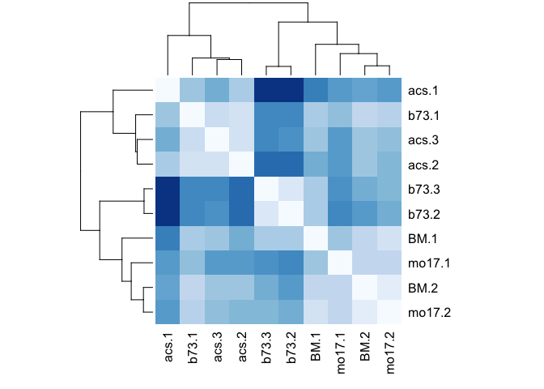<!-- -->

# heatmaps of individual protein expression

## heatmap:all

``` r
df_NoDecoys_Biomart_epost_bioreps.t <- t(df_NoDecoys_Biomart_epost_bioreps)
heatmap(df_NoDecoys_Biomart_epost_bioreps.t)
```

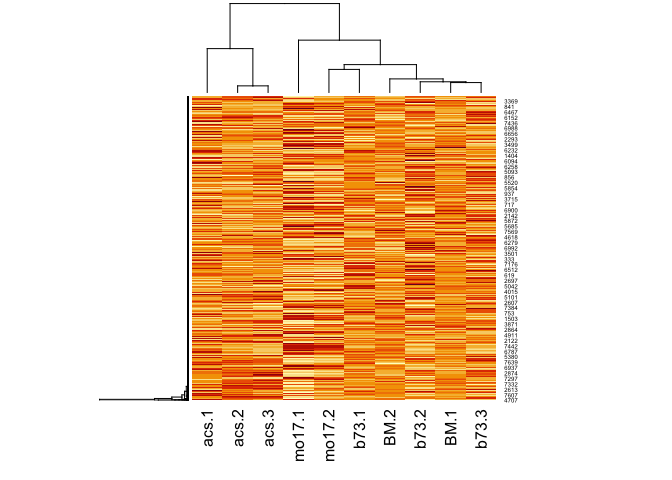<!-- --> \#\#
heatmap:plastid-encoded

``` r
df_NoDecoys_Biomart_epost_bioreps_plastid.t <- t(df_NoDecoys_Biomart_epost_bioreps_plastid)
heatmap(df_NoDecoys_Biomart_epost_bioreps_plastid.t)
```

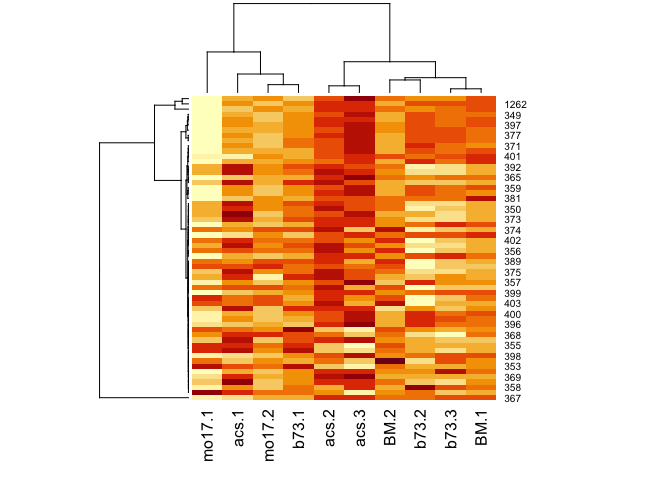<!-- --> \#\#
heatmap:<GO:photosynthesis>

``` r
df_NoDecoys_Biomart_epost_bioreps_go.photo.t <- t(df_NoDecoys_Biomart_epost_bioreps_go.photo)
heatmap(df_NoDecoys_Biomart_epost_bioreps_go.photo.t)
```

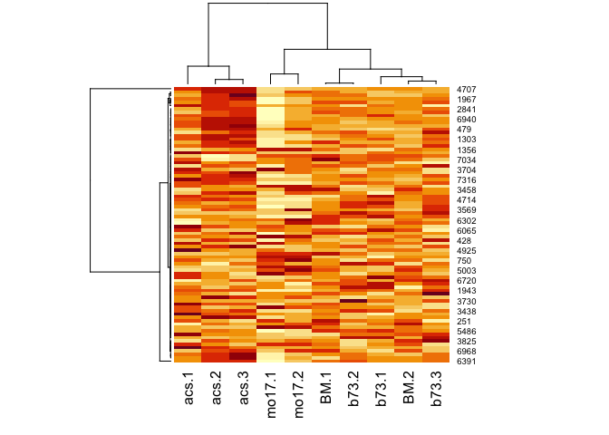<!-- --> \#\#
heatmap:ribosome

``` r
df_NoDecoys_Biomart_epost_bioreps_go.ribosome.t <- t(df_NoDecoys_Biomart_epost_bioreps_go.ribosome)
heatmap(df_NoDecoys_Biomart_epost_bioreps_go.ribosome.t)
```

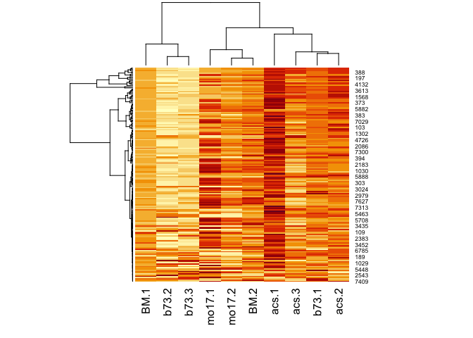<!-- -->

# PlotExp function

``` r
PlotExp <- function(V4acc){
b73 <- df_NoDecoys_Biomart_epost[((as.character(df_NoDecoys_Biomart_epost$V4))==V4acc), 3:5]
mo17 <- df_NoDecoys_Biomart_epost[((as.character(df_NoDecoys_Biomart_epost$V4))==V4acc), 6:7]
hyb <- df_NoDecoys_Biomart_epost[((as.character(df_NoDecoys_Biomart_epost$V4))==V4acc), 8:9]
acs <- df_NoDecoys_Biomart_epost[((as.character(df_NoDecoys_Biomart_epost$V4))==V4acc), 10:12]
all4 <- c(as.numeric(b73[1,]), as.numeric(mo17[1,]), as.numeric(hyb[1,]), as.numeric(acs[1,]))
all4df <- data.frame(sample=(c("b73.1", "b73.2", "b73.3", "mo17.1", "mo17.2", "hyb.1", "hyb.2", "acs.1", "acs.2", "acs.3")), TMT=all4)
all4df$sample <- factor(all4df$sample, levels = all4df$sample)
ggplot(data=all4df, aes(x=sample, y=TMT, width=0.75)) + geom_bar(stat="identity", fill = c("blue3", "blue3", "blue3", "red3", "red3",  "purple4", "purple4", "green3", "green3", "green3")) + labs(title=V4acc)
}
```

## Plotting genes

``` r
PlotExp("Zm00001d045479")
```

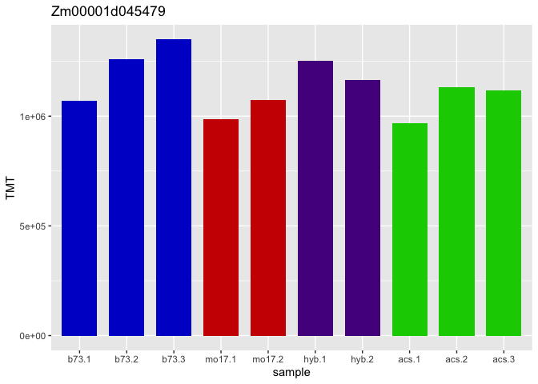<!-- -->
